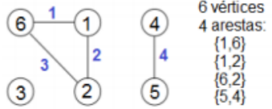
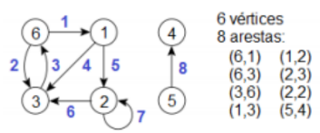

## 1. Introdução
Grafos são modelos matemáticos normalmente utilizados em diversas áreas para representar diferentes estruturas como mapas, redes de computadores, circuitos elétricos, circuitos, lógicos, máquinas de estados, dentre outras.

## 2. Objetivo
O presente trabalho propõe a implementação de uma TAD (*Tipo Abstrato de Dado*) para representar grafos e a sua utilização para solucionar os problemas computacionais que serão propostos.

## 3. Definições 

### 3.1 Grafos não direcionados

 

Um grafo não direcionado G(V,A) é um grafo cujas arestas não especificam a direção da relação.
  
### 3.2 Grafo direcionado

 

Um grafo direcionado G(V,A), ou dígrafo, é um grafo cujas arestas são formadas por pares ordenados de vértices

## 4. Operações
Para a implementação das rotinas que executam as operações são adotadas as seguintes convenções:
- O nome das rotinas é padronizado: tem sempre um prefixo de duas letras maiúsculas seguindo de um sufixo minúsculo. 
  - A primeira letra do prefixo é G e a segunda indica o tipo de retorno da rotina, caso seja:  ponteiro **Grafo (G)**,**identificador de vértice (V)**, **identificador de aresta (A)**, **valor booleano (B)**, **número inteiro (I)** ou **número real (F)**. O sufixo especifica a tarefa realizada na operação.
- Nenhuma rotina imprimirá mensagem de erro, se for constatado um erro então rotina será interrompida e retornará um código de erro convencionado (geralmente zero ou nulo).
- --